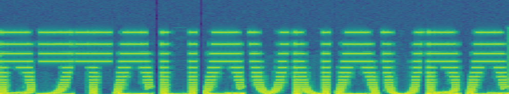
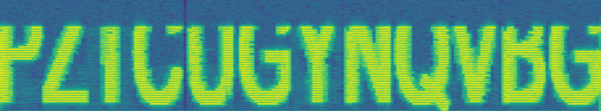
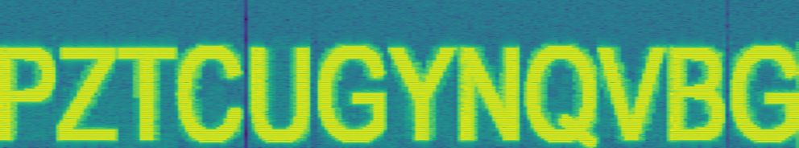
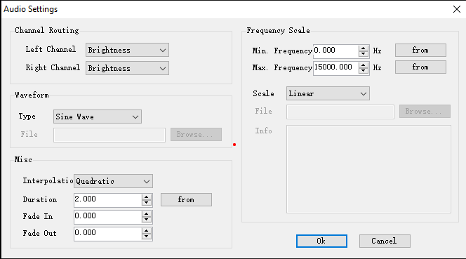
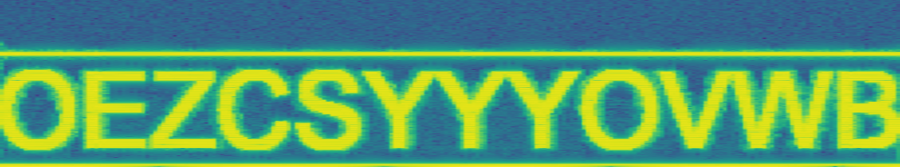
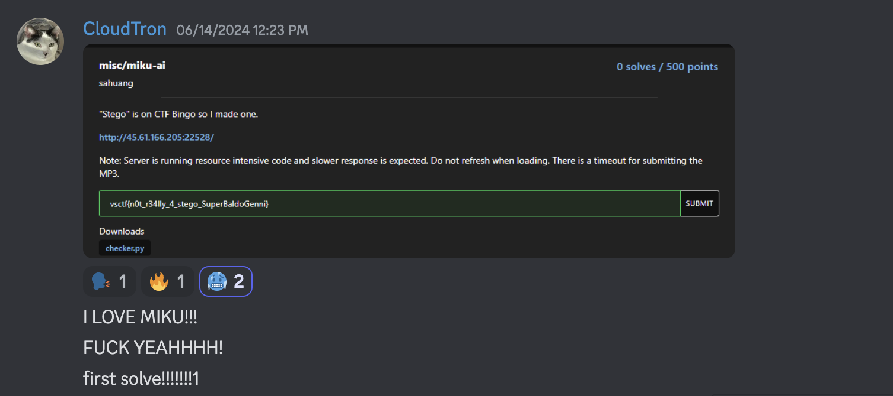
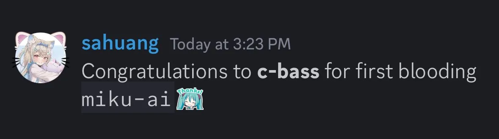

# Miku AI 

In this challenge, a given website interfaces with a server that sends an image with text. In response, we must submit audio that satisfies a set of conditions. Upon successful submission, we get the flag.

## Analyzing the Checker
Looking at the provided python file given for this challenge, we can see that there are 3 checks being done to the audio that we upload.

The first check calculates the Fast Fourier Transform (FFT) of our audio and then determines if the resulting mean frequency magnitude lies within the range of 500 to 1500.

```python
def check1(mp3: bytes) -> bool:
    _, data = wavfile.read(mp3_to_wav(mp3))
    fft_data = np.fft.fft(data)
    return 500 <= np.mean(np.abs(fft_data)) <= 1500
```
The Fast Fourier Transform is a way to transform a time-domain signal to a frequency-domain signal. If a fourer transformed signal were to be graphed, frequency instead of time would be on the x-axis. This allows us to see not just what frequencies are present in the original signal but *how much* of each frequency is present. In other words, this check ensures that the average of how much of each frequency is present is within a certain range we have to satisfy.

The second check uses a machine-learning model to classify the voice in our audio file, checking if it is similar to a female voice.
```python
def check2(mp3: bytes) -> bool:
    pipe = pipeline("audio-classification", model="alefiury/wav2vec2-large-xlsr-53-gender-recognition-librispeech")
    audio, rate = torchaudio.load(mp3_to_wav(mp3))
    transform = torchaudio.transforms.Resample(rate, 16000)
    audio = transform(audio).numpy().reshape(-1)

    prediction = pipe(audio) # predict with ai model
    # # how likely that this is a female voice
    prob = prediction[0]['score'] if prediction[0]['label'] == 'female' else prediction[1]['score']

    return prob > 0.9727
```
To satisfy this check, the audio we generate has to resemble a female voice to the ML model that analyzes it.

The third check, more comprehensive than others, accomplishes two tasks:
- It first generates a spectrogram of our audio, and saves that as an image. A spectrogram is simply a graph of the audio's frequency across time.
- Following this, it then reads text from the generated spectrogram, comparing the extracted text to the text in the image they gave you prior.
```python
def check3(mp3: bytes, res: str) -> bool:
    # generate spectrogram from audio
    sample_rate, data = wavfile.read(mp3_to_wav(mp3, True))

    plt.axis('off')
    plt.specgram(data, Fs=sample_rate, NFFT=512)
    buf = io.BytesIO()
    
    # save that graph as image
	plt.gcf().set_size_inches(2*plt.gcf().get_size_inches()[0], 0.5*plt.gcf().get_size_inches()[1])
    plt.savefig(buf, format='png', bbox_inches='tight')
    buf.seek(0)

    # authenticates Azure Vision credentials and creates a client.
    subscription_key = os.environ["VISION_KEY"]
    endpoint = os.environ["VISION_ENDPOINT"]
    computervision_client = ComputerVisionClient(endpoint, CognitiveServicesCredentials(subscription_key))

    # perform OCR on the image
    read_image = io.BufferedReader(buf)
    read_response = computervision_client.read_in_stream(read_image, raw=True)
    read_operation_location = read_response.headers["Operation-Location"]
    operation_id = read_operation_location.split("/")[-1]

    # call api and wait for the retrieval of the results
    while True:
        read_result = computervision_client.get_read_result(operation_id)
        if read_result.status.lower() not in ['notstarted', 'running']:
            break
        time.sleep(2)

    text_retrieved = ''
    if read_result.status == OperationStatusCodes.succeeded:
        for text_result in read_result.analyze_result.read_results:
            for line in text_result.lines:
                text_retrieved += line.text

	# compare the extracted text
    return text_retrieved.strip() == res
```
To pass this check, the text in our audio's spectrogram must match the text from the server's original image.

## Solving the Challenge
Given we now know how the checks work, we can now solve the challenge.

First, we need to generate the audio that can be converted to the wanted spectrogram. Doing some research, we find a program that does this for us, [AudioPaint](http://www.nicolasfournel.com/?page_id=125). Using the program's default settings and the original unmodified image provided by the challenge instance, we get a spectrogram that looks as below.



Unfortunately, this is not very readable. Messing around for some time with the settings menu, we find setting the `Frequency Scale / Scale` to Linear improves the quality of the image.



However, the image is still somewhat unclear, especially with the characters being cut off on the top. To improve this, we can change AudioPaint's settings further by changing `Channel Routing` to "Brightness" and `Frequency Scale / Max. Frequency` to 15000 Hz.



Interestingly, the ML model identifies our unchanged audio as a female voice with 99.8% certainty, even though we haven't modified it to pass the check. If the maximum frequency is considerably lower than this or of the minimum frequency isn't zero, the ML model will likely not classify our generated audio as a female voice.

Here are the settings we used with AudioPaint:



To further enhance the image quality, we can write a script to change the text color in the challenge's provided image to white. We observed that silences in the audio cause the spectrogram to break the audio into segments, creating blank gaps in the spectrogram. These gaps disrupt the text recognition system. To solve this, we added a white line below and above the characters to remove the silences in the audio.

Here is a script that does this:
```python
def modify_image(image_data):
    image = Image.open(io.BytesIO(image_data))
    
    # change all non-black pixels to white
    pixels = image.load()
    for i in range(image.width):
        for j in range(image.height):
            if pixels[i, j] != (0, 0, 0, 0):
                pixels[i, j] = (255, 255, 255, 255)
    
    # Extend the image by 20 pixels (10 on top, 10 below)
    extra = 20
    new_height = image.height + extra
    new_image = Image.new('RGBA', (image.width, new_height), (0, 0, 0, 0))
    new_image.paste(image, (0, (extra // 2)))
    
    # add a white line at the top
    for y in range(0, 2):
        for x in range(image.width):
            new_image.putpixel((x, y), (255, 255, 255))

    # add a white line at the bottom
    for y in range(new_height - 2, new_height):
        for x in range(image.width):
            new_image.putpixel((x, y), (255, 255, 255))
    
    # Return the modified image
    return new_image
```
It's worthwhile to note that the white line above the text isn't necessary. Only one line is needed to prevent the audio from being segmented.

This is what an image looked like before the modification:


A black background was added to make it easier to see.

This is what an image looked like after the modification:


With that, we get a clear spectrogram from the generated audio.



The audio in the spectrogram is linked [here](https://github.com/c-bassx/vsctf-2024-writeups/raw/main/misc/miku-ai/attachments/out.wav).

Voice Classifier Result: 0.9985 (99.85% Female)  
Azure Vision OCR Result: OEZCSYYOVWB

Lastly, let's fulfill the requirement from first check. It expects the mean frequency magnitude to be in the range of 500-1500, so let's use a script to modify our audio. As this simply adjusts the amplitude of our audio, it does not disrupt the text recognition system.
```python
def adjust_amplitude(input_file, output_file, target_min, target_max):
    # Read the audio file
    fs, data = wavfile.read(input_file)
    
    # Calculate the current FFT and its mean
    fft_data = np.fft.fft(data)
    current_mean = np.mean(np.abs(fft_data))
    
    # Calculate scale factor to bring the FFT mean into the target range
    if current_mean < target_min:
        scale_factor = target_min / current_mean
    elif current_mean > target_max:
        scale_factor = target_max / current_mean
    else:
        scale_factor = 1
    
    # Apply scale factor
    adjusted_data = data * scale_factor
    
    # Check new mean
    new_fft_data = np.fft.fft(adjusted_data)
    new_mean = np.mean(np.abs(new_fft_data))
    
    # Save adjusted audio
    wavfile.write(output_file, fs, adjusted_data.astype(np.int16))
    
    return new_mean
```
After the modification, our audio passes all three checks without a problem.

At this point, we are nearly done with the challenge. The last thing we need to do is upload our generated audio to the server and get our flag. However, when we tried to do this, we found the server had already disconnected. From this, we found there was a 15-second time limit starting when you clicked the button on the challenge, generating the image with text for you to generate audio from. To fix this, we have to automate as much as we can. Rather than writing code to generate audio, we could give ourselves some seconds to manually generate the audio using audiopaint then automate the rest.

Here is our final script.
```python
import websocket
import threading
import time
from PIL import Image
import io
from pydub import AudioSegment

from scipy.io import wavfile
import numpy as np

def adjust_amplitude(input_file, output_file, target_min, target_max):
    # Read the audio file
    fs, data = wavfile.read(input_file)
    
    # Calculate the current FFT and its mean
    fft_data = np.fft.fft(data)
    current_mean = np.mean(np.abs(fft_data))
    
    # Calculate scale factor to bring the FFT mean into the target range
    if current_mean < target_min:
        scale_factor = target_min / current_mean
    elif current_mean > target_max:
        scale_factor = target_max / current_mean
    else:
        scale_factor = 1
    
    # Apply scale factor
    adjusted_data = data * scale_factor
    
    # Check new mean
    new_fft_data = np.fft.fft(adjusted_data)
    new_mean = np.mean(np.abs(new_fft_data))
    
    # Save adjusted audio
    wavfile.write(output_file, fs, adjusted_data.astype(np.int16))
    
    return new_mean

def modify_image(image_data):
    # Load the image from bytes
    image = Image.open(io.BytesIO(image_data))
    
    # Process image to change all non-black pixels to white
    pixels = image.load()
    for i in range(image.width):
        for j in range(image.height):
            if pixels[i, j] != (0, 0, 0, 0):
                pixels[i, j] = (255, 255, 255, 255)
    
    # Extend the image downwards by 30 pixels
    extra = 20
    new_height = image.height + extra
    new_image = Image.new('RGBA', (image.width, new_height), (0, 0, 0, 0))
    new_image.paste(image, (0, (extra // 2)))
    
    # Add a 2-pixel white line at the top
    for y in range(0, 2):
        for x in range(image.width):
            new_image.putpixel((x, y), (255, 255, 255))

    # Add a 2-pixel white line at the bottom
    for y in range(new_height - 2, new_height):
        for x in range(image.width):
            new_image.putpixel((x, y), (255, 255, 255))
    
    # Return the modified image
    return new_image

def on_message(ws, message):
    if isinstance(message, bytes):
        message = modify_image(message)
        # Display the image
        image = message
        # Save the image as png (using 1111 as the name so it's easier to find in file explorer)
        image.save('11111.png')
        print("QUICK! GO NOW AND YOU HAVE 9 SECONDS")
        # Set a timer to send the MP3 file after 9 seconds to prevent timeout
        threading.Timer(9, send_mp3, args=(ws,)).start()
    else:
        # Print received message from the server
        print("Received message:", message)

def on_error(ws, error):
    print(f"Error: {error}")

def on_close(ws, close_status_code, close_msg):
    print("### closed ###")

def on_open(ws):
    print("Connection opened, sending 'start'")
    ws.send('start')

def send_mp3(ws):
    print("Sending MP3 file...")
    
    # Load out.wav
    input_filename = 'out.wav'
    output_filename = 'cp_fftpatch.wav'
    new_mean = adjust_amplitude(input_filename, output_filename, 500, 1500)
    print(f"New FFT Mean: {new_mean}")
    
    # Save the wav to mp3
    audio = AudioSegment.from_wav('cp_fftpatch.wav')
    audio.export('cp_fftpatch.mp3', format="mp3")

    # Load MP3 file data
    with open('cp_fftpatch.mp3', 'rb') as mp3file:
        mp3_data = mp3file.read()
        
    # Send MP3 file data to the server
    ws.send(mp3_data, websocket.ABNF.OPCODE_BINARY)
    print("MP3 file sent.")

# uwu
def main():
    websocket.enableTrace(True)
    ws = websocket.WebSocketApp("ws://45.61.166.205:22528/echo",
                                on_open=on_open,
                                on_message=on_message,
                                on_error=on_error,
                                on_close=on_close)

    ws.run_forever()

if __name__ == "__main__":
    main()
```
Now, all one has to do is simply setup AudioPaint with the right parameters, run the script, and wait for the image. Then, in AudioPaint, press CTRL+I to load the image, click 'generate', and use CTRL+E to save the audio as `out.wav`. Before starting, create a temporary `out.wav` file for quick saving.

Doing this, we get the flag! 
```
vsctf{n0t_r34lly_4_stego_SuperBaldoGenni}
```

Some notable moments from the challenge:



